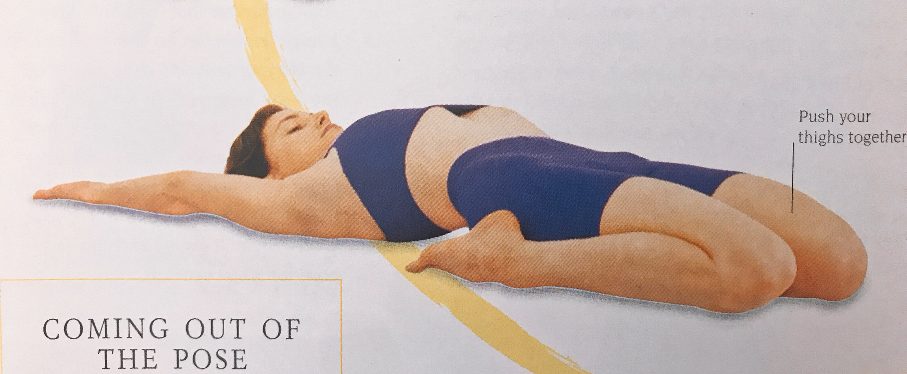
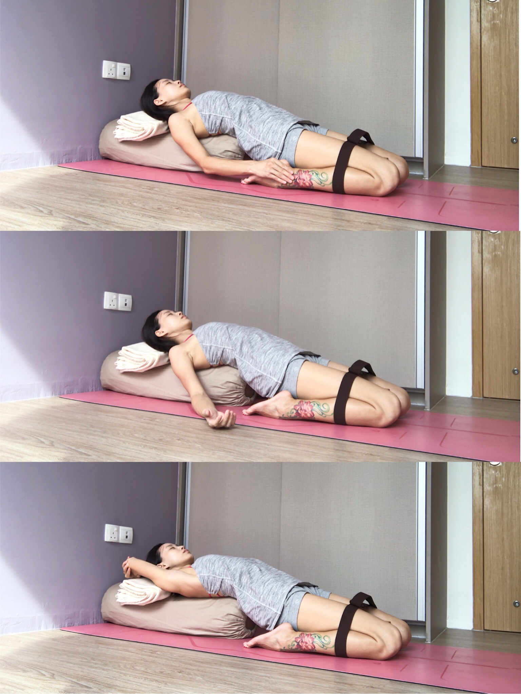
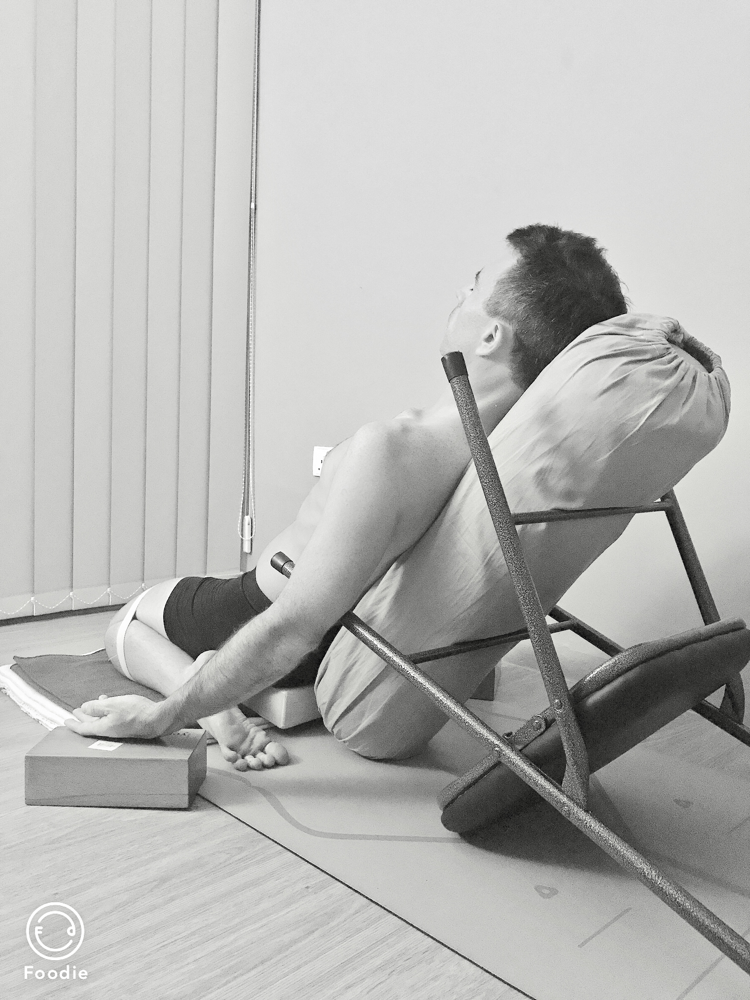

Yoga asanas (postures) are good for your health in both physical body and mind. But things always have two sides. In the other hand, yoga asanas might hurt you as well if you do it the wrong way. The asana is an intermediary tool. It serves for our body, not the opposite. We use it to become better. So how to do the Asana is an important question. For example, Supta Virasana:

This is **the final** pose from _THE PATH TO HOLISTIC HEALTH BY B.K.S.IYENGAR_

### This Asana(posture) is intended to:

* Stretch the quadriceps femoris (front thigh muscles)
* Build the arch of the feet
* Open the groin and chest
* Relax the lower back and relieve lower back pain
* It's useful in case of acidity, rheumatism, disorders of the ovaries etc.

Different individuals are different, some people are flexible, some people are stiff. So **we need to find a good and right way to practice the same Asana**. Otherwise, the Asana might hurt you as you push your body forcedly into the shape of the posture.

I can lie down on the mat without any props as I'm quite flexibility. But my pelvic and hip joint have some issues and are painful. So I need to create space that is allowed me to be alignment  in my knees, hip joints and groins.

My husband Darryl is quite tense and rigid around his ankles, knees and front thigh muscles. So he needs a high support under his back. Gradually, the support will be lower and lower.

In the posture, the first feeling he told me is he can breath deeply. That's a good feedback that means he feels good in it. That deep breath comes naturally is not as same as you force yourself to do it deeply. You feel released, relaxed and comfortable in it. This Asana is a very good restorative posture as well.

**In yoga asanas, we need to work hard and enjoy it.**
