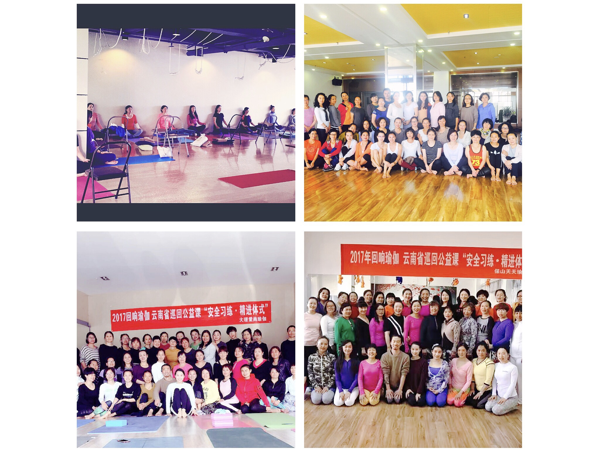

I'll finish my 3 year Iyengar Yoga Teacher Training Course in July 2019. Time have flown quickly. Thinking back over these years, I attended 2 TTCs, one was 200 hour yoga TTC in Rishikesh, India, the other is Iyengar yoga TTC in Shenzhen, China. I also had a few intensive courses and workshops in China and Singapore. I learned lots from these great teachers in how to teach and practice.

It's easy to be a yoga teacher, but it's difficult to be a good or great yoga teacher. It's easy to teach a yoga class, but it's difficult to teach an effective and attractive yoga class.

I'm working on the latter.

#### Learning Experiences

##### 2012 -- 200 hours Yoga Teacher Training Course In Rishkesh, India

##### 2014 -- China And India Yoga Convention In Dali, China

##### 2015 -- Iyengar Yoga Teacher, Manouso -- Light On Yoga Workshop

##### 2015 -- Iyengar Yoga Intensive Course 1 & 2 In China Iyengar Yoga Institute

##### 2015 -- Iyengar Yoga Teacher, Zubin Workshop In Beijing, China

##### 2016 -- Iyengar Yoga Teacher, Rita Keller -- Iyengar Yoga For Motherhood Workshop

##### 2016 to 2019 -- 3 year Iyengar Yoga Teacher Training Course In Shenzhen, China

##### 2018 -- Riana Workshop In Iyengar Yoga Centre Singapore

##### 2019 -- Timothy Khoo, Intensive Course In Oasis Holistic Singapore

#### Teaching Experiences from 2014 to 2017

