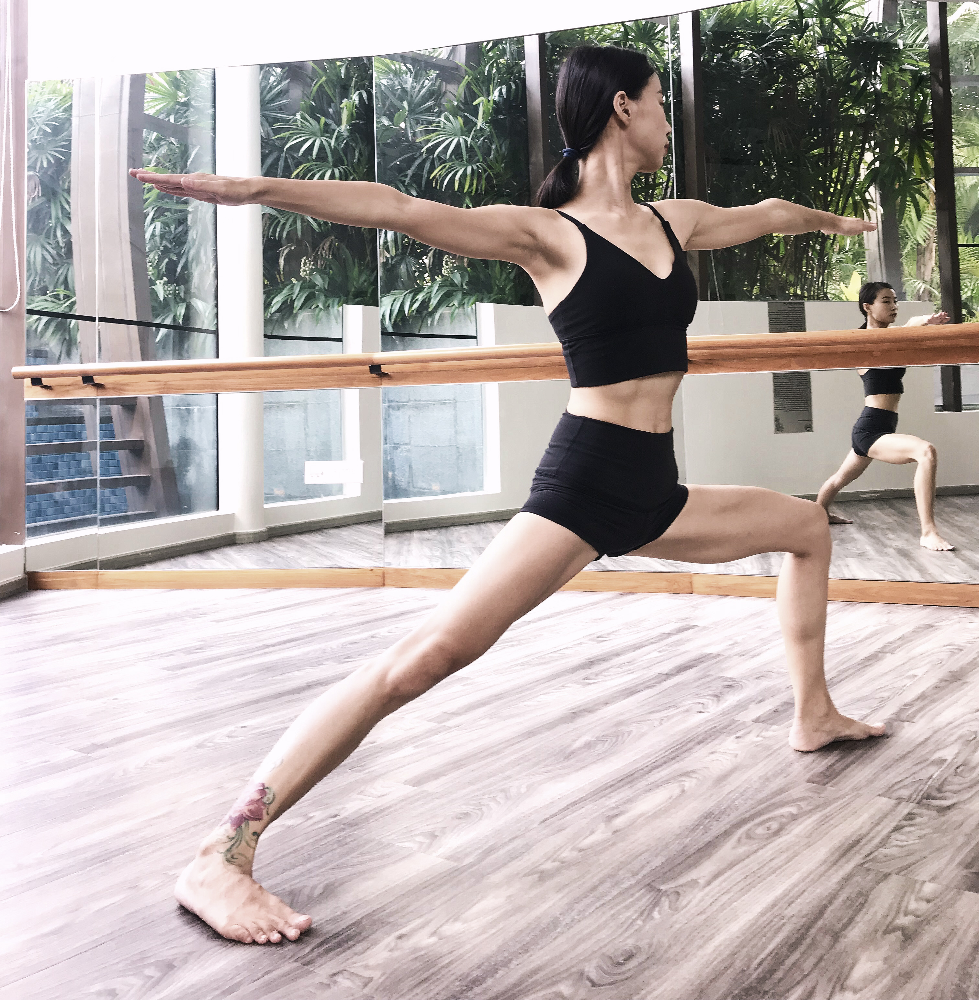

> As ordinary people, those who are not inclined towards the spiritual aspect can take to Yoga for its physical benefits. Health of the body and the mind is important to all, whether they wish to succeed in their worldly pursuits or in Self-Realization.  ---- YOGA-A GEM FOR WOMEN by Geeta S. Iyengar

Hi everyone, I’m Lulu and I'm a professional yoga instructor, and student of Iyengar yoga, with 8 years of experience. I’m going to teach some classes in the Glades, so if you'd like to join then please get in touch - details below.

Iyengar yoga focuses on posture, precision and alignment. It’s good for your health, and fun too! Classes can be in English or Chinese, and can be 1-on-1 or in small groups. Beginners and advanced practitioners are welcome - don’t worry about it being difficult, we are not going to focus on the beautiful, fancy, or advanced poses, but rather on effective and safe postures that are good for your health.

**WHEN**

* On request - [contact me](mailto:lulu@theone.yoga) to arrange a time.

**HOW MUCH**

Free for first timers. $25 per class after that.

**WHAT TO PREPARE**

1. Yoga mat
2. Comfortable yoga or sports clothes
3. Yoga blocks (optional)
4. Yoga belt (optional)

Please arrive early.

**GET IN TOUCH**

* Tel & Whatsapp: 8145 0422
* WeChat: 185 8719 0114
* Web: https://theone.yoga
* Facebook: https://www.facebook.com/the1yoga

**WHY YOU SHOULD DO YOGA**

1. It's a healthy and effective alternative to the treadmill
2. It can help you relax if you are stressed or have tension
3. It can help with lower back pain, shoulder or neck pain etc.
4. It can improve or enhance your strength, flexibility, balance, and awareness.

